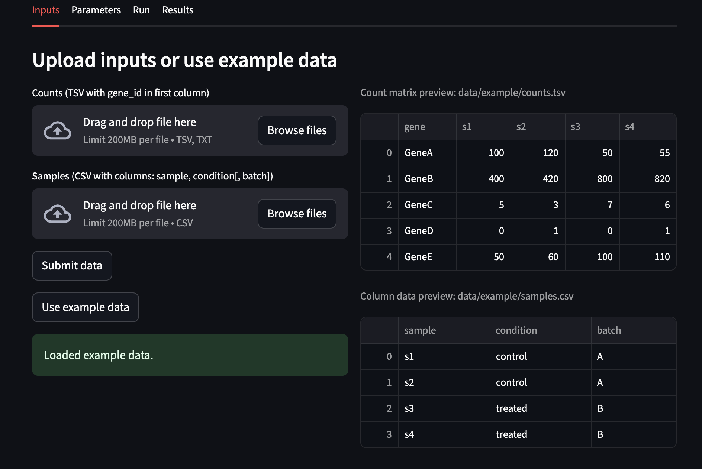
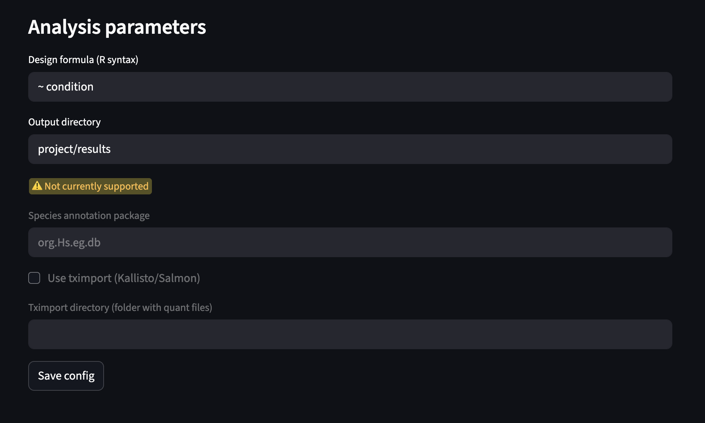
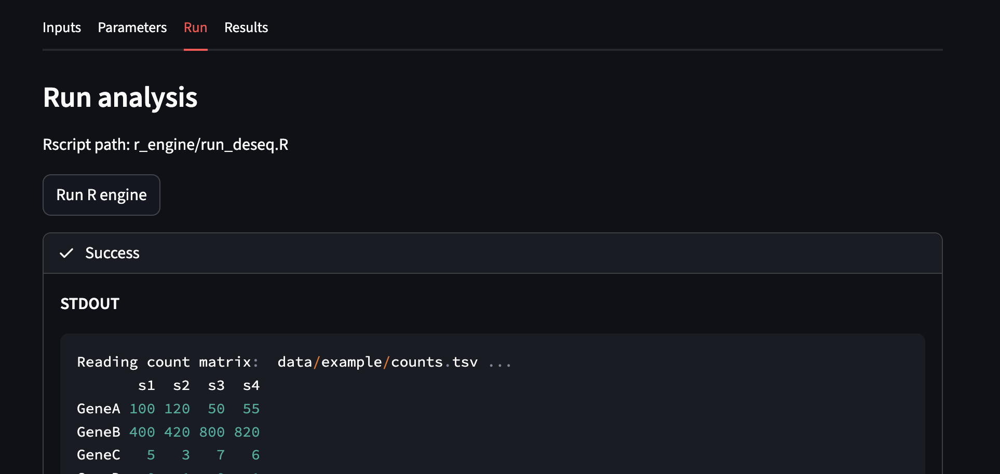
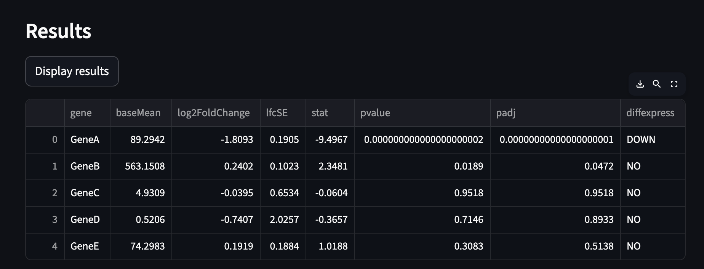
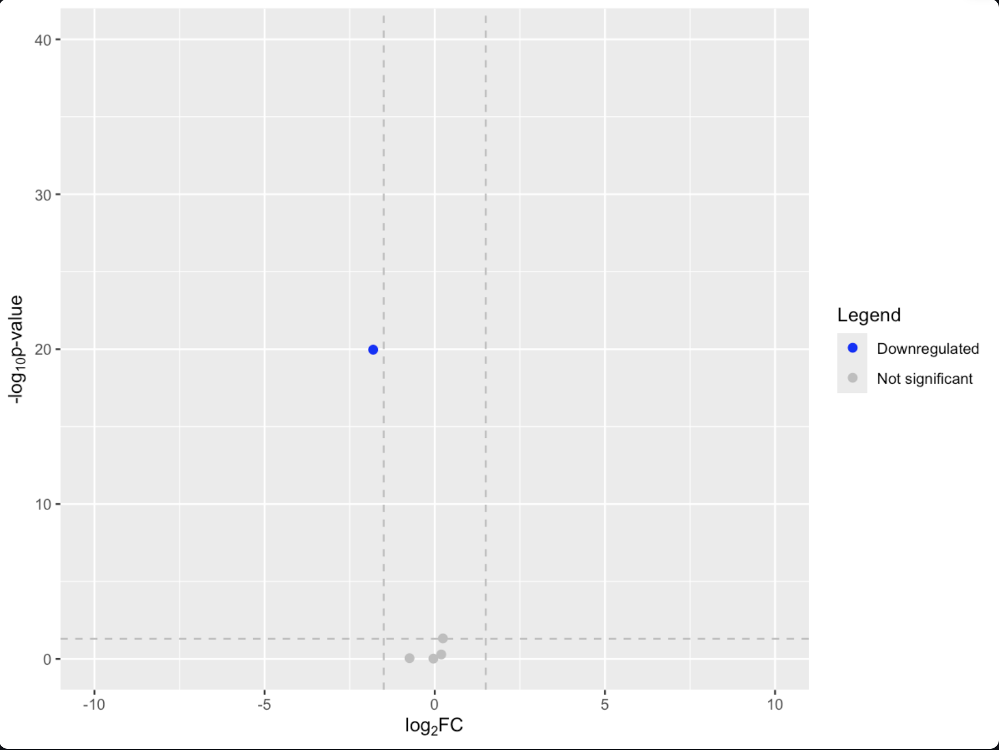

# stream-seq
Analysis tool for rna seq data.

---

# Overview

The goal of this project is to create a lightweigh browser based GUI for basic
differential expression analysis of RNA-seq data. The underlying engine for
analysis is DESeq2/R. The outputs produced include a csv with expression values and a simple volcano plot.

The main usage of this project is for quick/preliminary analysis of prepared RNA-seq
data to minimize the need to write R boilerplate or go back through and change previously
used scripts. The use of mamba as a package manager aims to make the use of this tool reproducible across separate machines with a fast/efficient start up. 

In the works are more analysis types (GO enrichment, Pathway ORA, clustering/heatmaps)
as well as a file formatting page to quickly make changes to files without having to rely
on writing separate Python/Perl scripts or using awk and bash commands.

Any comments or suggestions are more than welcome!

---

# Getting Started

``` Bash
mamba env create -f menv/environment.yaml
mamba activate stream-seq
streamlit run app/streamlit_app.py
```

---

# Examples

#### Loading Files


#### Analysis Config


#### Running Analysis


#### Results

